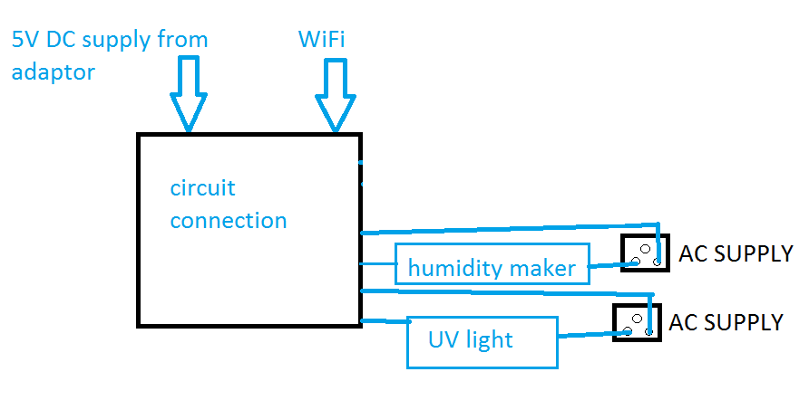
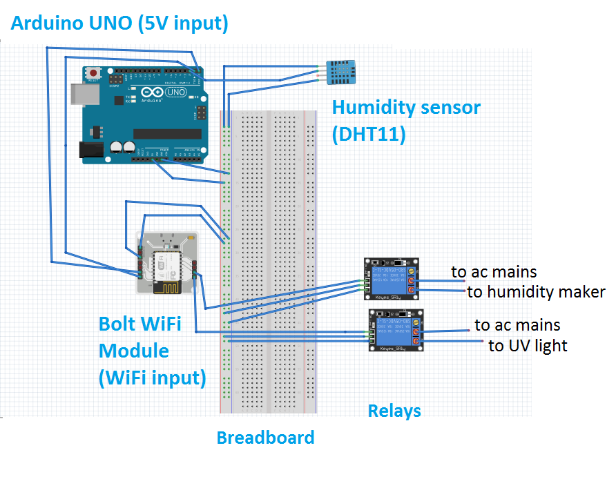

# Protection Monitoring System (Corona Project)
Controls the humidity and UVC (ultra violet germicidal)  light over the internet to sanitize our home and working  places and reduce the risk of covid-19.

# Story
1. **Introduction** 
1) In more humid condition the droplets containing virus come from sneezing or coughing come down to floor quickly and within few minutes drop containing virus settle to floor and hence virus transmission reduces so much.
But in low humidity condition the drops containing the virus long last about hours.
 2) UV light has been used for years to kill bacteria and viruses and ultraviolet light has been used as a disinfectant for a century in hospitals and water supplies. It shatters the genetic material inside viruses, bacteria and other microbes. Menachery said, and disinfecting UV light can’t be used with people around because it damages human cells.

As it damage human cells so it should not be used in presence of human but we can use it over the internet to make our home and working places sanitize and reduce the risk of covid-19 without our presence at that place.
UV light is lethal to viruses because of its high frequency that scramble and damage their nuclear material .when it damage the DNA (or RNA) codes of these pathogens it also trigger lethal mutation that prevent them from reproducing themselves.

**Reference**:
1. What the structure of the coronavirus can tell us(By Bonnie Berkowitz, Aaron Steckelberg and John Muyskens March 23, 2020
https://www.washingtonpost.com/graphics/2020/health/coronavirus-sars-cov-2-structure/
2. Does UV Light Kill Viruses and Germs?( MAR. 19, 2020)
(By Liza Corsillo) https://nymag.com/strategist/article/does-uv-light-kill-germs-best-sterilizer.html

**Demonstration** 
1.	Checking humidity reading from Bolt android app.               
2.	Controlling humidity and UV light over the internet.

# Things used in this project
Hardware components
1. Bolt IOT Wi-Fi module
2. Arduino Uno
3. Relay (2)
4. Breadboard
5. Humidity sensor (DHT11)
6. Humidity maker
7. Exhaust fan
8.  UVC (ultra violet germicidal)

**Software/apps and online services**
1. Bolt IOT android app
2. Fritzing 
3. Webpage(our web application)

# Steps for building the project
**1.	Connecting bolt Wi-Fi module with arduino**
To connect bolt device to arduino first install the Bolt arduino helper library in arduino IDE you may check the complete guide on this link https://docs.boltiot.com/docs/arduino-library.

Now connections 

      Bolt device    arduino
        Tx---->       Rx(D0)
        Rx---->       Tx(D1)
        5V---->       5V
        GND--->       GND

**2.	Getting humidity reading from arduino**
To get humidity value we use DHT11 sensor and connect to arduino digital pin 2 to take the value as it gives value in digital output.
Library installation

To use DHT11 we have to use install a library in arduino IDE 
1.	 Open arduino IDE and Click on 
Sketch -> Include Library ->Manage Libraries
2.	 Install the library 

**Connections**

                    DHT11          arduino
          Output (DATA)   ---->    pin2 (D2)
          Power pin (VDD) ---->    5V 
          GND             ---->    GND

Connect power pin of DHT11 to 5V and GND to GND.
And we use the code below to get humidity value and send it to bolt cloud with help of the command boltiot.processPushDataCommand()

                #include <SimpleDHT.h>
                #include <BoltIoT-Arduino-Helper.h>
                // for DHT11, 
                //      VCC: 5V or 3V
                //      GND: GND
                //      DATA: 2
                //---------------------------------------------setting digital pin 2 as input------------------------------------------------------
                int pinDHT11 = 2;
                //-----------------------------calling the simpleDHT11 function and passing the variable in function-----------------------------
                SimpleDHT11 dht11(pinDHT11);
                //----------------------------------declaring API_KEY  key and device ID------------------------------------------------------------
                //---------------NOTE-----insert API and bolt device ID below in the mentioned field-------------------------------------------- 
                #ifndef API_KEY
                #define API_KEY   " xxxxxxx-xxxx-xxxx-xxxx-xxxxxxxx "
                #endif
                #ifndef DEVICE_ID
                #define DEVICE_ID "BOLTXXXXXX"
                #endif
                
                void setup() {
                boltiot.begin(Serial);
                }
                //--------------------------------------collecting Data from DHT11----------------------------------------------------------
                void loop() {
                  // start working...
                  // read without samples.
                  byte temperature = 0;
                  byte humidity = 0;
                  int err = SimpleDHTErrSuccess;
                  if ((err = dht11.read(&temperature, &humidity, NULL)) != SimpleDHTErrSuccess) {
                    delay(1000);
                    return;
                  }
                //------------------------converting byte value to integer value and assigning it to new variable------------------------------
                 int hum= (int)humidity;
                
                  // DHT11 sampling rate is 1HZ.
                //---------------------------------------------------------------sending data to bolt cloud----------------------------
                  boltiot.processPushDataCommand(hum);
                  delay(1500);}

**3.	Configure the bolt cloud and product**

Go to bolt cloud and select a new product of UART and input device.
Now set the product as below

Now chose file extention as Js and code as below

                setChartLibrary('google-chart');
                setChartTitle('Humidity Monitring');
                setChartType('lineGraph');
                setAxisName('time','humidity');
                plotChart('time_stamp','humidity');
                
                

Now cloud is ready to use and to plot the humidity with time.

**4.  Making of webpage**
We have to make a Webpage to access the bolt Wi-Fi module and turning on/off UV light and humidity maker with the help of relays and they are supply by ac at our home and other places.

Input of relays connected with GPIO 1 and 2 of bolt module to monitor UV light and humidity maker.
Below is the html code of webpage with buttons on it to switch the UV light and humidity maker.
We have to save the below code with file extention .html and open it in a browser to connect to our device and control the UV light and Humidity maker.
Note: Remember to provide API key and device ID respectively in setKey() function below in the code

                        <!DOCTYPE html>
                        <html>
                        <head>
                            <title>home protection</title>
                            
                                
                        </head>
                        <body >
                        	
<h1>UV light</h1>

                            

                            	
<button onClick="digitalWrite(1,HIGH);" style="height: 50px;width: 100px"><h2>on</h2></button>
                            <button onClick="digitalWrite(1,LOW);" style="height: 50px;width: 100px"><h2>off</h2></button>
                            

                             
                             
                            
<h1>Humidity control</h1>

                        
                                
<button  onClick="digitalWrite(2,HIGH);"  style="height: 50px;width: 100px"><h2>on</h2></button>
                                <button onClick="digitalWrite(2,LOW);" style="height: 50px;width: 100px"><h2>off</h2></button>
                                

                            

                        
                        </body>
                        </html>

**5.	Circuit connection**

**6.	Device Installation setup**

# Controlling
**Procedure to use my system **

**1.	Checking humidity status **
Check current status of humidity in your home through bolt IOT app which linked with bolt Wi-Fi module.

**2.	Now open the webpage that we have created ….**

**3.	Increasing of humidity:**
Switch on the humidity maker by clicking on button under humidity control.
To control UV light:
To control UV light use buttons under UV light to on/off the light.

